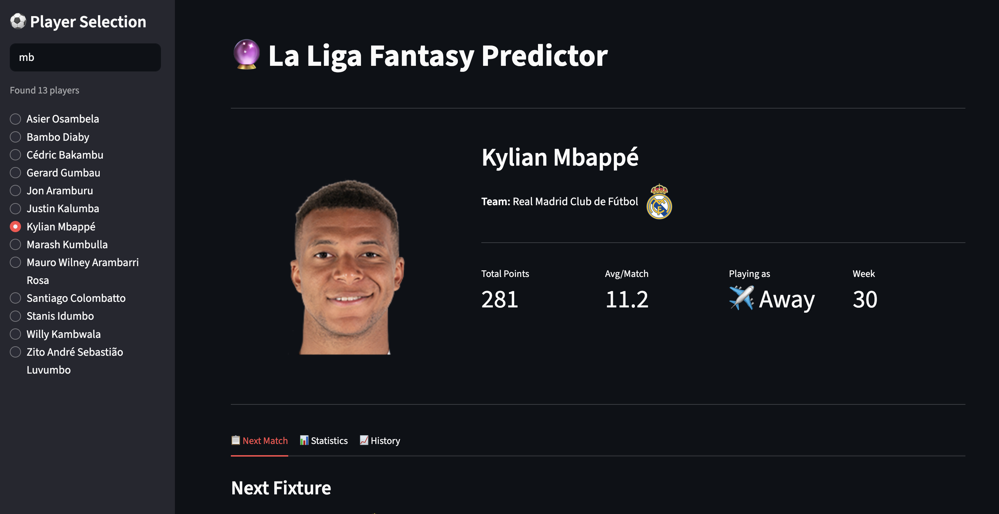
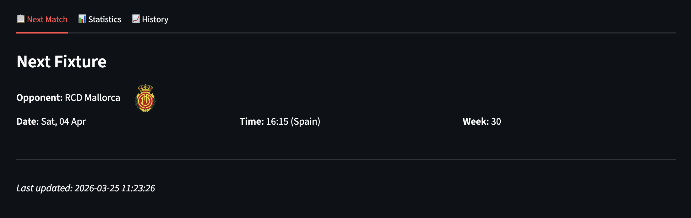
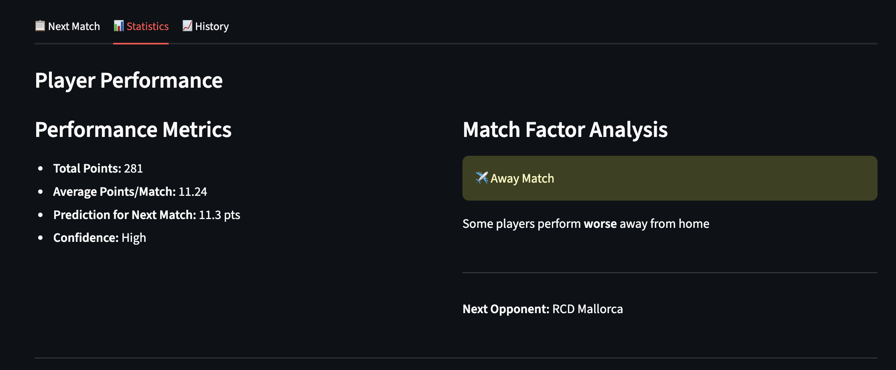
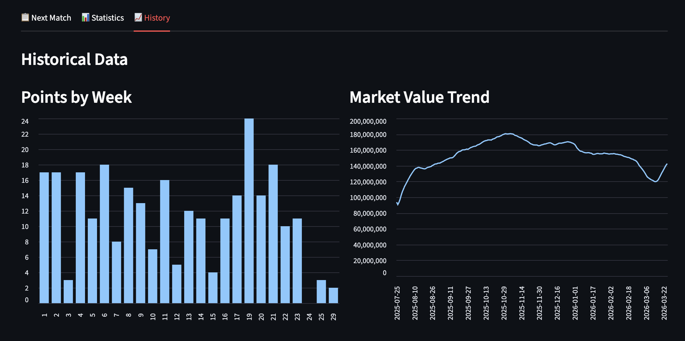

# Fantasy La Liga Predictor

Fantasy La Liga Predictor is a machine learning model that provides users with accurate and timely recommendations on which players to purchase and at what price, ultimately helping users to create a winning Fantasy team for the Spanish football league, La Liga.

## Screenshots

### Home Screen - Player Selection & Stats

The main interface shows the La Liga Fantasy Predictor with:

- 🔍 Search box to quickly find players among 957 available options
- Real-time filtered list showing matching players
- Player statistics: Total Points, Avg/Match, Playing as (Home/Away), Current Week
- Team badge displayed inline with team name

### Next Match Tab

Displays upcoming fixture information:

- Opponent team with badge
- Match date and time (converted to Spain timezone)
- Current matchday/week number

### Statistics Tab

Performance analytics:

- Total career points and average points per match
- Prediction for next match (±15% variance)
- Confidence level (High/Medium/Low)
- Home/Away advantage analysis

### History Tab

Charts and trends:

- Points by week (bar chart)
- Market value trend over time (line chart)

## Architecture

The architecture pipeline of the project is as follows:

1. **Data Extraction**: Extract data from Fantasy LaLiga API with Lambda Function
2. **Data Storage**: Store raw data on S3
3. **Data Transformation**: This triggers a function app that initializes a Sagemaker Notebook to transform the data by cleaning and performing feature engineering and storing this final dataset on S3
4. **Model Training**: Train model using SageMaker and save it on S3
5. **Model Deployment**: Deploy model to a SageMaker Serverless instance

## Features

The model uses the following features to predict the performance of a player in the next match:

- Average number of points earned in the last 5 matches
- Total number of goals scored in the last 5 matches
- Average number of minutes played in the last 5 matches
- Number of previous injuries
- Average number of points earned at home
- Average number of points earned away

## Usage

To use the app, you will need to deploy the Lambda functions and API Gateway as described in the Architecture section. Once you have deployed the necessary resources, you can run the app using the following command:
`streamlit run app.py`

This will start the Streamlit app, which you can access by navigating to http://localhost:8501 in your web browser. From there, you can enter the name or ID of a player and the app will return a recommendation on whether to buy or not based on the player's predicted performance in the next match.

## Contributors

- [Quique Mendez](https://github.com/quiquemz)
- [Juliette Navarre](https://www.linkedin.com/in/juliette-navarre/)
- [Ka Ho Wan](https://www.linkedin.com/in/terrancewankaho/)
- [Bob Bury](https://www.linkedin.com/in/bob-bury-/)
- [Liza Shaban](https://www.linkedin.com/in/liza-shaban-%F0%9F%87%BA%F0%9F%87%A6-791336190/)

## License

This project is licensed under the terms of the MIT license.
